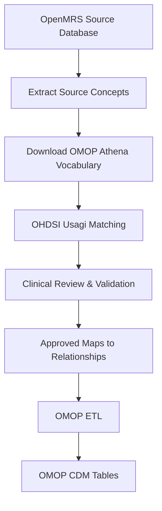

# 🏥 Semantic Harmonization Pipeline
## OpenMRS → OMOP CDM Standardized Vocabulary Mapping


---

## 📖 Overview

Healthcare organizations often maintain Electronic Health Record (EHR) systems using local or proprietary clinical terminologies. These localized vocabularies limit interoperability, making it difficult to conduct multi-center observational studies or participate in federated research networks.

This repository demonstrates a semantic harmonization pipeline that maps an **OpenMRS** source database to the **OMOP Common Data Model (CDM v6.0)** using standardized clinical vocabularies.

The project prepares clinical data for interoperability by translating local concepts into internationally recognized standards, including:

- **SNOMED CT**
- **RxNorm**
- **LOINC**

The resulting mappings support downstream ETL processes used in platforms such as:

- OHDSI
- EHDEN
- PCORnet

---

# 🎯 Project Objectives

- Convert localized OpenMRS concepts into OMOP Standard Concepts
- Improve semantic interoperability across healthcare systems
- Enable standardized observational research
- Support reproducible ETL workflows
- Demonstrate enterprise clinical data engineering practices

---

# 🛠 Technologies & Standards

| Category | Technologies |
|-----------|--------------|
| Clinical Data Model | OMOP CDM v6.0 |
| Source System | OpenMRS |
| Mapping Tool | OHDSI Usagi |
| Vocabulary Source | OHDSI Athena |
| Medical Terminologies | SNOMED CT, RxNorm, LOINC |
| Matching Algorithm | Jaro-Winkler Similarity |
| Output | CSV Mapping Tables |

---

# 🏗 Repository Structure

```text
.
├── .gitignore
├── ConceptClassIds.txt
├── DomainIds.txt
├── VocabularyIds.txt
├── vocabularyVersion.txt
├── usagi_mappings.csv
└── condition_mappings.csv
```

---

## 📂 Repository Contents

| File | Description |
|------|-------------|
| `.gitignore` | Excludes databases, caches and generated files |
| `ConceptClassIds.txt` | Restricts mappings to approved OMOP Concept Classes |
| `DomainIds.txt` | Limits mappings to specific OMOP domains |
| `VocabularyIds.txt` | Restricts searches to standard vocabularies |
| `vocabularyVersion.txt` | Documents Athena vocabulary release used |
| `usagi_mappings.csv` | Master terminology mapping file |
| `condition_mappings.csv` | Condition-specific mapping output |

---

# 🔄 End-to-End Mapping Workflow



---

# 📋 Mapping Methodology

## 1. Source Concept Extraction

Clinical concepts are extracted from OpenMRS source tables, including:

- Concept names
- Local identifiers
- Drug names
- Diagnoses
- Clinical observations

---

## 2. Vocabulary Acquisition

The latest standardized vocabularies are downloaded from the **OHDSI Athena** repository, including:

- SNOMED CT
- RxNorm
- LOINC

These vocabularies form the reference knowledge base used during semantic mapping.

---

## 3. Automated Lexical Matching

Concepts are imported into **OHDSI Usagi**, which performs automated similarity matching using the **Jaro-Winkler** algorithm.

Each candidate mapping receives a similarity score ranging from:

```
0.00  →  1.00
```

Higher scores indicate stronger lexical similarity.

---

## 4. Domain Restrictions

To reduce false-positive mappings, searches are constrained using repository configuration files.

### Domain Filters

```
DomainIds.txt
```

Restricts mappings to domains such as:

- Drug
- Condition
- Measurement
- Observation

---

### Concept Class Filters

```
ConceptClassIds.txt
```

Restricts mappings to valid OMOP concept classes such as:

- Clinical Drug
- Ingredient
- Diagnosis
- Procedure

---

### Vocabulary Filters

```
VocabularyIds.txt
```

Restricts candidate concepts to approved vocabularies:

- SNOMED CT
- RxNorm
- LOINC

---

## 5. Clinical Validation

Automated mappings undergo manual expert review to:

- Resolve ambiguous matches
- Validate clinical meaning
- Correct orphan concepts
- Approve final mappings

Approved concepts receive the standard OMOP relationship:

```text
relationship_id = "Maps to"
```

---

# 📤 Downstream ETL Integration

The generated mapping tables become lookup resources during ETL execution.

### Drug Concepts

```
Source Drug
        │
        ▼
usagi_mappings.csv
        │
        ▼
DRUG_EXPOSURE
```

---

### Diagnosis Concepts

```
Source Diagnosis
        │
        ▼
condition_mappings.csv
        │
        ▼
CONDITION_OCCURRENCE
```

---

# ✅ Skills Demonstrated

- Clinical Data Engineering
- Healthcare Data Interoperability
- OMOP Common Data Model
- OHDSI Ecosystem
- Semantic Harmonization
- Medical Terminology Mapping
- SNOMED CT
- RxNorm
- LOINC
- Clinical Data Governance
- Metadata Management
- ETL Design
- Vocabulary Engineering
- Data Standardization

---

# 📚 References

- OHDSI
- OMOP Common Data Model v6.0
- OHDSI Athena
- OHDSI Usagi
- OpenMRS
- SNOMED CT
- RxNorm
- LOINC

---

# 👤 Author

**Uchemadu Nwachukwu**

*MSc Applied Clinical Data Analytics*

Clinical Data Analyst • Clinical Informatician • Healthcare Interoperability • OMOP CDM • Real-World Data • Clinical Research
